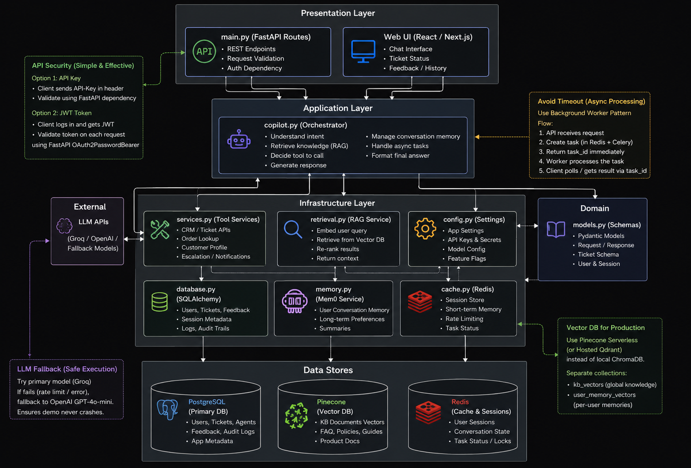

```markdown
# 🤖 AI-Powered Customer Support Agent with Memory & Tool Calling

An intelligent customer support copilot that automates ticket context gathering. By combining **RAG for policy lookup**, **Mem0/LangMem for persistent user memory**, and **LangChain tool calling for CRM and billing operations**, this agent generates ready-to-review responses in a single click, saving support teams up to 60% of their manual context-switching time.

---

## 📌 System Architecture

```text
                        ┌─────────────────────────┐
                        │   User / Support Rep    │
                        └────────────┬────────────┘
                                     │
                                     ▼
                        ┌─────────────────────────┐
                        │    Streamlit UI / API   │
                        └────────────┬────────────┘
                                     │
                                     ▼
                        ┌─────────────────────────┐
                        │  LangChain Agent Engine │
                        └────────────┬────────────┘
                                     │
    ┌────────────────────────────────┼────────────────────────────────┐
    │                                │                                │
    ▼                                ▼                                ▼
┌───────────────────────┐ ┌───────────────────────┐ ┌───────────────────────┐
│ Memory Layer          │ │ Knowledge Base (RAG)  │ │ Tool Execution Layer  │
│ (Mem0 / Short & Long) │ │ (FAISS / Vector DB)   │ │ (SQL / CRM / Billing) │
└───────────────────────┘ └───────────────────────┘ └───────────────────────┘

## 📌 Overall Architecture:




```

---

## ✨ Core Features & Tech Stack

* **Persistent User Memory:** Integrates **Mem0 / LangMem** to retain customer history, preferences, and prior ticket interactions across turns.
* **Agentic RAG Engine:** Leverages dense vector retrieval for policy manuals, FAQs, and terms of service.
* **Dynamic Tool Calling:** Native tool-calling schemas via LangChain to execute SQL database queries for billing lookups, customer account status, and order updates.
* **FastAPI Asynchronous Layer:** Serves structured JSON responses via REST API endpoints for seamless integration into existing helpdesk portals.
* **Streamlit Copilot Interface:** Interactive UI allowing support agents to review, edit, or auto-generate customer replies.

### Tech Stack

* **Language:** Python 3.10+
* **LLM:** OpenAI (GPT-4o / GPT-4o-mini) / Groq Llama-3
* **Agent Framework:** LangChain & LangGraph
* **Memory Management:** Mem0, LangMem
* **Vector Database:** PostGreSQL, Redis, Pinecone
* **Backend:** FastAPI, Pydantic v2
* **Frontend UI:** Streamlit

---

## 📂 Repository Structure

```text
├── .github/                # GitHub actions, CI/CD pipelines, & issue templates
├── customer_support_agent/ # Core agent package, node definitions & state workflows
├── docs/                   # Architecture diagrams, API specs, & documentation
├── evals/                  # Evaluation framework & LLM-as-a-Judge benchmark datasets
├── knowledge_base/         # RAG documents, policy PDFs, & domain context files
├── notebooks/              # Jupyter notebooks for prototyping & experiments
├── tests/                  # Unit and integration test suites
├── .gitignore              # Files & folders ignored by Git
├── .python-version         # Python environment version specifier
├── app.py                  # Web application UI (Streamlit / FastAPI entrypoint)
├── docker-compose.yaml     # Container orchestration for app & services
├── Dockerfile              # Docker container build specifications
├── flow.excalidraw         # Architecture & execution flow diagram design file
├── main.py                 # Primary execution script
├── output.md               # Generated sample outputs & logs
├── pyproject.toml          # Project dependencies & tool configurations
├── README.md               # Project overview and documentation
└── uv.lock                 # Lockfile for precise UV dependency management

```

---

## 🚀 Quickstart Guide

### 1. Clone & Set Up Environment

```bash
git clone [https://github.com/](https://github.com/)<YOUR-USERNAME>/AI-Powered-Customer-Support-Agent.git
cd AI-Powered-Customer-Support-Agent

python -m venv venv
# On Windows:
venv\Scripts\activate
# On macOS/Linux:
source venv/bin/activate

```

### 2. Install Dependencies

```bash
pip install -r requirements.txt

```

### 3. Configure `.env`

Create a `.env` file in the project root:

```env
OPENAI_API_KEY=your_openai_api_key
MEM0_API_KEY=your_mem0_api_key
LANGCHAIN_TRACING_V2=true
LANGCHAIN_API_KEY=your_langsmith_api_key

```

### 4. Run the Application

* **Start Backend API:**
```bash
uvicorn app.api.main:app --reload --port 8000

```


* **Start Streamlit Dashboard:**
```bash
streamlit run streamlit_app.py

```
